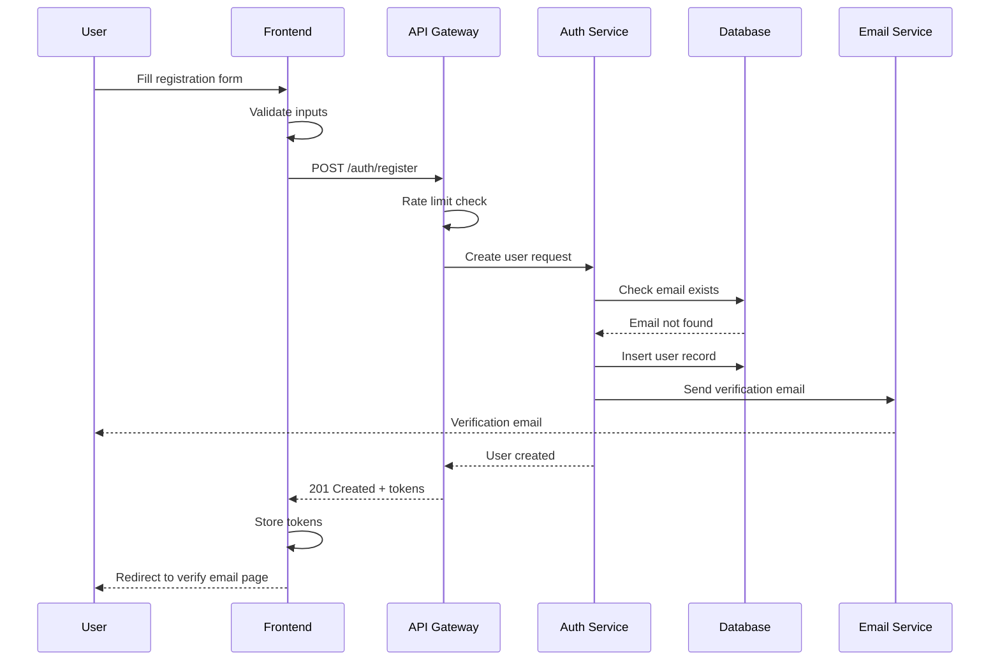
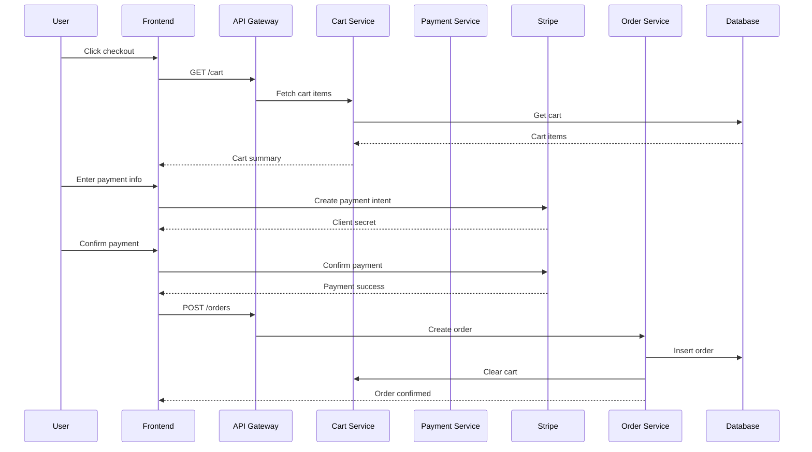

# SECTION 03: THE UNIVERSAL DEVELOPMENT WORKFLOW - 50X ENHANCED

> **OLYMPUS MASTER BLUEPRINT - Section 3 of 22**
> **Status:** 50X Enhancement Complete
> **Original:** 4 Phases, 10 Build Steps, ~10 Testing Items
> **Enhanced:** 10 Phases, 50+ Workflows, 150+ Checklist Items, 50+ Tools

---

## TABLE OF CONTENTS

1. [Phase 1: Discovery & Research](#phase-1-discovery--research)
2. [Phase 2: Requirements & PRD](#phase-2-requirements--prd)
3. [Phase 3: Architecture & Design](#phase-3-architecture--design)
4. [Phase 4: Wireframing & Prototyping](#phase-4-wireframing--prototyping)
5. [Phase 5: Environment Setup](#phase-5-environment-setup)
6. [Phase 6: Build Sequence](#phase-6-build-sequence)
7. [Phase 7: Testing & QA](#phase-7-testing--qa)
8. [Phase 8: Code Review & Documentation](#phase-8-code-review--documentation)
9. [Phase 9: Deployment & CI/CD](#phase-9-deployment--cicd)
10. [Phase 10: Monitoring & Maintenance](#phase-10-monitoring--maintenance)

---

# PHASE 1: DISCOVERY & RESEARCH

> **Duration:** 1-3 days | **Output:** Research Brief | **Tools:** ChatGPT, Perplexity, SimilarWeb

## 1.1 Market Research Template

```markdown
# Market Research Brief

## Industry Overview
- **Market Size:** $[X] billion (2025)
- **Growth Rate:** [X]% CAGR
- **Key Players:** [List top 5 competitors]
- **Market Trends:**
  1. [Trend 1]
  2. [Trend 2]
  3. [Trend 3]

## Target Market
- **TAM (Total Addressable Market):** $[X]
- **SAM (Serviceable Addressable Market):** $[X]
- **SOM (Serviceable Obtainable Market):** $[X]

## Customer Segments
| Segment | Size | Pain Points | Willingness to Pay |
|---------|------|-------------|-------------------|
| [Name]  | [%]  | [List]      | [$/month]         |

## Market Entry Strategy
- **Positioning:** [Differentiation]
- **Go-to-Market:** [Strategy]
- **Pricing Model:** [Freemium/Subscription/One-time]
```

## 1.2 Competitor Analysis Framework

```markdown
# Competitor Analysis Matrix

## Direct Competitors

| Competitor | Strengths | Weaknesses | Pricing | Market Share |
|------------|-----------|------------|---------|--------------|
| [Name 1]   | [List]    | [List]     | [$/mo]  | [%]          |
| [Name 2]   | [List]    | [List]     | [$/mo]  | [%]          |
| [Name 3]   | [List]    | [List]     | [$/mo]  | [%]          |

## Feature Comparison

| Feature       | Us | Comp 1 | Comp 2 | Comp 3 |
|---------------|:--:|:------:|:------:|:------:|
| [Feature 1]   | -  | X      | X      | -      |
| [Feature 2]   | -  | X      | -      | X      |
| [Feature 3]   | -  | -      | X      | X      |

## Competitive Advantage
- **Our Unique Value:** [What we do better]
- **Blue Ocean Strategy:** [Untapped opportunity]
- **Defensibility:** [Why hard to copy]
```

## 1.3 Technology Research Template

```markdown
# Technology Stack Research

## Requirements Assessment
- **Scale:** [Users expected]
- **Performance:** [Response time, throughput]
- **Budget:** [Monthly infrastructure cost]
- **Team Skills:** [Languages/frameworks known]

## Options Evaluated

### Option A: [Stack Name]
| Aspect       | Rating | Notes |
|--------------|:------:|-------|
| Performance  | 9/10   | [Why] |
| Developer XP | 8/10   | [Why] |
| Cost         | 7/10   | [Why] |
| Scalability  | 9/10   | [Why] |
| Ecosystem    | 8/10   | [Why] |
| **Total**    | **41/50** |    |

### Option B: [Stack Name]
[Same format]

### Option C: [Stack Name]
[Same format]

## Decision
- **Selected:** [Stack]
- **Rationale:** [Top 3 reasons]
- **Risks:** [Identified risks]
- **Mitigations:** [How to handle risks]
```

## 1.4 User Research Template

```markdown
# User Research Summary

## Research Methods Used
- [ ] User Interviews (n = [X])
- [ ] Surveys (n = [X])
- [ ] Analytics Analysis
- [ ] Competitor User Reviews
- [ ] Social Media Listening
- [ ] Support Ticket Analysis

## User Personas

### Persona 1: [Name]
- **Demographics:** [Age, Job, Location]
- **Goals:** [What they want to achieve]
- **Frustrations:** [Current pain points]
- **Tech Savviness:** [Beginner/Intermediate/Expert]
- **Quote:** "[Actual quote from research]"

### Persona 2: [Name]
[Same format]

## Key Insights
1. **Insight 1:** [Finding] → [Implication]
2. **Insight 2:** [Finding] → [Implication]
3. **Insight 3:** [Finding] → [Implication]

## Jobs to Be Done (JTBD)
| When I...         | I want to...      | So I can...       |
|-------------------|-------------------|-------------------|
| [Situation]       | [Motivation]      | [Outcome]         |
```

## 1.5 Design Inspiration Collection

```markdown
# Design Inspiration Board

## Reference Sites
| Site | What I Like | Screenshot Link |
|------|-------------|-----------------|
| [URL]| [Specific elements] | [Link] |

## Design Patterns
- **Navigation:** [Pattern from X]
- **Cards:** [Pattern from Y]
- **Forms:** [Pattern from Z]
- **Tables:** [Pattern from W]
- **Modals:** [Pattern from V]

## Color Inspirations
- **Palette 1:** [URL to palette]
- **Palette 2:** [URL to palette]

## Typography Inspirations
- **Heading:** [Font from X]
- **Body:** [Font from Y]

## Animation Inspirations
- **Micro-interactions:** [Reference]
- **Page Transitions:** [Reference]
- **Loading States:** [Reference]
```

## 1.6 Discovery Phase Checklist

```markdown
## Discovery Checklist

### Market Research
- [ ] Defined market size (TAM/SAM/SOM)
- [ ] Identified top 5 competitors
- [ ] Analyzed competitor pricing
- [ ] Mapped industry trends
- [ ] Identified market gaps

### User Research
- [ ] Created user personas (minimum 2)
- [ ] Documented pain points
- [ ] Identified Jobs to Be Done
- [ ] Validated problem exists
- [ ] Confirmed willingness to pay

### Technology Research
- [ ] Evaluated 3+ tech stack options
- [ ] Assessed team capabilities
- [ ] Estimated infrastructure costs
- [ ] Identified technical risks
- [ ] Made stack decision

### Design Research
- [ ] Collected 10+ design inspirations
- [ ] Identified design patterns
- [ ] Chose color direction
- [ ] Selected typography
- [ ] Noted animation style

### Documentation
- [ ] Created Research Brief
- [ ] Shared with stakeholders
- [ ] Got sign-off to proceed
```

---

# PHASE 2: REQUIREMENTS & PRD

> **Duration:** 2-5 days | **Output:** PRD Document | **Tools:** Notion, Google Docs, Figma

## 2.1 Comprehensive PRD Template

```markdown
# Product Requirements Document (PRD)

## Document Info
| Field | Value |
|-------|-------|
| **Product Name** | [Name] |
| **Version** | 1.0 |
| **Author** | [Name] |
| **Date** | [Date] |
| **Status** | Draft / In Review / Approved |

---

## 1. Executive Summary

### 1.1 Problem Statement
[In 2-3 sentences, describe the problem we're solving]

### 1.2 Solution Overview
[In 2-3 sentences, describe our solution]

### 1.3 Success Metrics
| Metric | Current | Target | Timeline |
|--------|---------|--------|----------|
| [KPI 1]| [X]     | [Y]    | [Months] |
| [KPI 2]| [X]     | [Y]    | [Months] |

---

## 2. User Personas

### Primary Persona: [Name]
- **Role:** [Job title]
- **Goals:** [What they want]
- **Pain Points:** [Current frustrations]
- **Tech Level:** [Beginner/Intermediate/Expert]

### Secondary Persona: [Name]
[Same format]

---

## 3. User Stories & Acceptance Criteria

### Epic 1: [Epic Name]

#### Story 1.1: [Story Title]
**As a** [user type]
**I want to** [action]
**So that** [benefit]

**Acceptance Criteria:**
- [ ] Given [context], when [action], then [result]
- [ ] Given [context], when [action], then [result]
- [ ] Given [context], when [action], then [result]

**Priority:** Must Have / Should Have / Could Have / Won't Have
**Estimate:** S / M / L / XL

#### Story 1.2: [Story Title]
[Same format]

---

## 4. Feature Specifications

### Feature 1: [Feature Name]

#### Description
[What this feature does]

#### User Flow
1. User [action 1]
2. System [response 1]
3. User [action 2]
4. System [response 2]

#### UI Requirements
- [Component needed]
- [Interaction behavior]
- [Responsive behavior]

#### Business Rules
- [Rule 1]
- [Rule 2]

#### Edge Cases
| Scenario | Expected Behavior |
|----------|-------------------|
| [Edge case 1] | [Behavior] |
| [Edge case 2] | [Behavior] |

#### Technical Requirements
- API endpoints needed
- Database tables affected
- Third-party integrations

---

## 5. Data Models

### Entity: [Name]
| Field | Type | Required | Notes |
|-------|------|----------|-------|
| id | UUID | Yes | Primary key |
| [field] | [type] | [Yes/No] | [Notes] |

### Relationships
- [Entity A] has many [Entity B]
- [Entity B] belongs to [Entity A]

---

## 6. API Requirements

### Endpoint: [Method] /api/[path]
- **Purpose:** [Description]
- **Auth:** Required / Public
- **Request:**
```json
{
  "field": "value"
}
```
- **Response (200):**
```json
{
  "success": true,
  "data": {}
}
```
- **Errors:** 400, 401, 404, 500

---

## 7. Non-Functional Requirements

### Performance
- Page load: < 3 seconds
- API response: < 500ms
- Time to interactive: < 5 seconds

### Security
- Authentication method
- Authorization levels
- Data encryption

### Accessibility
- WCAG 2.1 AA compliance
- Keyboard navigation
- Screen reader support

### Browser Support
- Chrome (last 2 versions)
- Firefox (last 2 versions)
- Safari (last 2 versions)
- Edge (last 2 versions)

---

## 8. Release Plan

### MVP (Phase 1)
| Feature | Priority | Status |
|---------|----------|--------|
| [Feature 1] | Must Have | Planned |
| [Feature 2] | Must Have | Planned |

### V1.1 (Phase 2)
| Feature | Priority | Status |
|---------|----------|--------|
| [Feature 3] | Should Have | Backlog |

### V2.0 (Phase 3)
| Feature | Priority | Status |
|---------|----------|--------|
| [Feature 4] | Could Have | Backlog |

---

## 9. Open Questions
| # | Question | Owner | Due Date | Status |
|---|----------|-------|----------|--------|
| 1 | [Question] | [Name] | [Date] | Open |

---

## 10. Appendix
- Wireframes: [Link]
- Design Mockups: [Link]
- Technical Spec: [Link]
- Research Brief: [Link]
```

## 2.2 Feature Prioritization Framework (MoSCoW + RICE)

```markdown
# Feature Prioritization Matrix

## MoSCoW Analysis

### Must Have (MVP)
| Feature | Justification |
|---------|--------------|
| [Feature] | [Why essential for launch] |

### Should Have (V1.1)
| Feature | Justification |
|---------|--------------|
| [Feature] | [Why important but not critical] |

### Could Have (V2.0+)
| Feature | Justification |
|---------|--------------|
| [Feature] | [Nice to have, low priority] |

### Won't Have (Out of Scope)
| Feature | Justification |
|---------|--------------|
| [Feature] | [Why excluded] |

---

## RICE Scoring

| Feature | Reach | Impact | Confidence | Effort | Score |
|---------|:-----:|:------:|:----------:|:------:|:-----:|
| [Feature 1] | [1-10] | [1-5] | [0.5-1] | [1-10] | [R*I*C/E] |
| [Feature 2] | [1-10] | [1-5] | [0.5-1] | [1-10] | [R*I*C/E] |

**Reach:** How many users affected (1-10)
**Impact:** How much value (1=minimal, 5=massive)
**Confidence:** How sure are we (0.5=low, 1=high)
**Effort:** Person-weeks required (1-10)

**Formula:** (Reach × Impact × Confidence) / Effort

---

## Final Priority Order
1. [Highest RICE score feature]
2. [Second highest]
3. [Third highest]
...
```

## 2.3 Business Model Canvas Template

```markdown
# Business Model Canvas

┌─────────────────────────────────────────────────────────────────────────────┐
│ KEY PARTNERS          │ KEY ACTIVITIES        │ VALUE PROPOSITION          │
│                       │                       │                            │
│ • [Partner 1]         │ • [Activity 1]        │ • [Value 1]               │
│ • [Partner 2]         │ • [Activity 2]        │ • [Value 2]               │
│ • [Partner 3]         │ • [Activity 3]        │ • [Value 3]               │
│                       │                       │                            │
├───────────────────────┼───────────────────────┼────────────────────────────┤
│ KEY RESOURCES         │ CUSTOMER RELATIONS    │ CUSTOMER SEGMENTS          │
│                       │                       │                            │
│ • [Resource 1]        │ • [Channel 1]         │ • [Segment 1]             │
│ • [Resource 2]        │ • [Channel 2]         │ • [Segment 2]             │
│ • [Resource 3]        │ • [Channel 3]         │ • [Segment 3]             │
│                       │                       │                            │
├───────────────────────┴───────────────────────┼────────────────────────────┤
│ COST STRUCTURE                                │ REVENUE STREAMS            │
│                                               │                            │
│ • [Cost 1] - [Amount]                         │ • [Revenue 1] - [Amount]  │
│ • [Cost 2] - [Amount]                         │ • [Revenue 2] - [Amount]  │
│ • [Cost 3] - [Amount]                         │ • [Revenue 3] - [Amount]  │
│                                               │                            │
└───────────────────────────────────────────────┴────────────────────────────┘
```

## 2.4 User Journey Mapping Template

```markdown
# User Journey Map: [Journey Name]

## Journey Overview
- **Persona:** [Name]
- **Goal:** [What they want to achieve]
- **Scenario:** [Context of the journey]

## Journey Stages

### Stage 1: Awareness
| Touchpoint | User Action | Thinking | Feeling | Pain Points | Opportunities |
|------------|-------------|----------|---------|-------------|---------------|
| [Where] | [What] | [Thoughts] | [Emotion] | [Frustration] | [Improvement] |

### Stage 2: Consideration
| Touchpoint | User Action | Thinking | Feeling | Pain Points | Opportunities |
|------------|-------------|----------|---------|-------------|---------------|
| [Where] | [What] | [Thoughts] | [Emotion] | [Frustration] | [Improvement] |

### Stage 3: Decision
| Touchpoint | User Action | Thinking | Feeling | Pain Points | Opportunities |
|------------|-------------|----------|---------|-------------|---------------|
| [Where] | [What] | [Thoughts] | [Emotion] | [Frustration] | [Improvement] |

### Stage 4: Onboarding
| Touchpoint | User Action | Thinking | Feeling | Pain Points | Opportunities |
|------------|-------------|----------|---------|-------------|---------------|
| [Where] | [What] | [Thoughts] | [Emotion] | [Frustration] | [Improvement] |

### Stage 5: Usage
| Touchpoint | User Action | Thinking | Feeling | Pain Points | Opportunities |
|------------|-------------|----------|---------|-------------|---------------|
| [Where] | [What] | [Thoughts] | [Emotion] | [Frustration] | [Improvement] |

### Stage 6: Retention
| Touchpoint | User Action | Thinking | Feeling | Pain Points | Opportunities |
|------------|-------------|----------|---------|-------------|---------------|
| [Where] | [What] | [Thoughts] | [Emotion] | [Frustration] | [Improvement] |

## Key Insights
1. [Insight from journey mapping]
2. [Insight from journey mapping]
3. [Insight from journey mapping]

## Priority Improvements
1. [High-impact improvement]
2. [Medium-impact improvement]
3. [Quick win]
```

## 2.5 Risk Assessment Template

```markdown
# Risk Assessment Matrix

## Risk Categories
- **T:** Technical
- **B:** Business
- **O:** Operational
- **S:** Security
- **L:** Legal/Compliance

## Risk Register

| ID | Risk | Category | Likelihood | Impact | Score | Mitigation | Owner |
|:--:|------|:--------:|:----------:|:------:|:-----:|------------|:-----:|
| R1 | [Description] | T | High | High | Critical | [Strategy] | [Name] |
| R2 | [Description] | B | Medium | High | High | [Strategy] | [Name] |
| R3 | [Description] | S | Low | Critical | High | [Strategy] | [Name] |
| R4 | [Description] | O | Medium | Medium | Medium | [Strategy] | [Name] |

## Risk Matrix

```
              │ Low Impact │ Medium │ High │ Critical │
──────────────┼────────────┼────────┼──────┼──────────┤
High          │   Medium   │  High  │ High │ Critical │
Likelihood    │            │        │      │          │
──────────────┼────────────┼────────┼──────┼──────────┤
Medium        │    Low     │ Medium │ High │   High   │
Likelihood    │            │        │      │          │
──────────────┼────────────┼────────┼──────┼──────────┤
Low           │    Low     │  Low   │Medium│   High   │
Likelihood    │            │        │      │          │
```

## Contingency Plans

### R1: [Critical Risk Name]
- **Trigger:** [What indicates risk is occurring]
- **Response:** [Immediate action to take]
- **Communication:** [Who to notify]
- **Recovery:** [Steps to recover]
```

## 2.6 PRD Phase Checklist

```markdown
## PRD Phase Checklist

### Document Creation
- [ ] Executive summary written
- [ ] Problem statement clear
- [ ] Solution overview defined
- [ ] Success metrics identified

### User Requirements
- [ ] Personas documented (minimum 2)
- [ ] User stories written (all features)
- [ ] Acceptance criteria defined
- [ ] Edge cases identified

### Feature Definition
- [ ] All features specified
- [ ] User flows documented
- [ ] Business rules defined
- [ ] UI requirements listed

### Technical Requirements
- [ ] Data models designed
- [ ] API endpoints defined
- [ ] Non-functional requirements listed
- [ ] Browser support defined

### Planning
- [ ] Features prioritized (MoSCoW/RICE)
- [ ] MVP scope defined
- [ ] Release phases planned
- [ ] Risks assessed

### Review
- [ ] Stakeholder review complete
- [ ] Questions resolved
- [ ] Sign-off obtained
```

---

# PHASE 3: ARCHITECTURE & DESIGN

> **Duration:** 2-4 days | **Output:** Architecture Docs | **Tools:** Excalidraw, Mermaid, Figma

## 3.1 System Architecture Template

```markdown
# System Architecture Document

## Architecture Overview

```
┌─────────────────────────────────────────────────────────────────────┐
│                           CLIENT LAYER                               │
├─────────────────────────────────────────────────────────────────────┤
│  ┌─────────────┐  ┌─────────────┐  ┌─────────────┐                 │
│  │   Web App   │  │  Mobile App │  │   Admin     │                 │
│  │   (React)   │  │   (Expo)    │  │  Dashboard  │                 │
│  └──────┬──────┘  └──────┬──────┘  └──────┬──────┘                 │
│         │                │                │                          │
│         └────────────────┼────────────────┘                          │
│                          │                                           │
│                          ▼                                           │
├─────────────────────────────────────────────────────────────────────┤
│                           API GATEWAY                                │
│  ┌──────────────────────────────────────────────────────────────┐  │
│  │  Rate Limiting │ Authentication │ Request Validation │ CORS  │  │
│  └──────────────────────────────────────────────────────────────┘  │
├─────────────────────────────────────────────────────────────────────┤
│                         SERVICE LAYER                                │
│  ┌───────────┐  ┌───────────┐  ┌───────────┐  ┌───────────┐       │
│  │   Auth    │  │   User    │  │  Product  │  │   Order   │       │
│  │  Service  │  │  Service  │  │  Service  │  │  Service  │       │
│  └─────┬─────┘  └─────┬─────┘  └─────┬─────┘  └─────┬─────┘       │
├────────┼──────────────┼──────────────┼──────────────┼────────────────┤
│        │              │              │              │                 │
│        ▼              ▼              ▼              ▼                 │
│  ┌──────────────────────────────────────────────────────────────┐  │
│  │                    DATABASE LAYER                             │  │
│  │  ┌──────────┐  ┌──────────┐  ┌──────────┐  ┌──────────┐     │  │
│  │  │PostgreSQL│  │  Redis   │  │  S3/CDN  │  │ Vector DB│     │  │
│  │  │ (Primary)│  │ (Cache)  │  │ (Files)  │  │ (Search) │     │  │
│  │  └──────────┘  └──────────┘  └──────────┘  └──────────┘     │  │
│  └──────────────────────────────────────────────────────────────┘  │
└─────────────────────────────────────────────────────────────────────┘
```

## Component Specifications

### Web Application
- **Framework:** React 18 + TypeScript
- **Build Tool:** Vite
- **Styling:** Tailwind CSS + shadcn/ui
- **State:** Zustand + React Query
- **Routing:** React Router v6

### API Layer
- **Type:** REST + Real-time WebSocket
- **Auth:** JWT + Refresh Tokens
- **Rate Limit:** 100 req/min per user
- **Caching:** Redis (5min TTL default)

### Database Layer
- **Primary:** PostgreSQL 15
- **Cache:** Redis 7
- **Files:** Supabase Storage (S3)
- **Search:** Qdrant Vector DB (optional)
```

## 3.2 Data Flow Diagram Template

```markdown
# Data Flow Diagrams

## User Registration Flow



## Checkout Flow


```

## 3.3 Component Hierarchy Template

```markdown
# Component Architecture

## Component Tree

```
src/
├── App.tsx
├── components/
│   ├── ui/                    # shadcn/ui base components
│   │   ├── button.tsx
│   │   ├── input.tsx
│   │   ├── card.tsx
│   │   └── ...
│   │
│   ├── layout/                # Layout components
│   │   ├── Header/
│   │   │   ├── Header.tsx
│   │   │   ├── Navigation.tsx
│   │   │   ├── UserMenu.tsx
│   │   │   └── index.ts
│   │   ├── Sidebar/
│   │   │   ├── Sidebar.tsx
│   │   │   ├── SidebarItem.tsx
│   │   │   └── index.ts
│   │   ├── Footer/
│   │   └── PageLayout.tsx
│   │
│   ├── features/              # Feature-specific components
│   │   ├── auth/
│   │   │   ├── LoginForm.tsx
│   │   │   ├── SignupForm.tsx
│   │   │   ├── ForgotPassword.tsx
│   │   │   └── index.ts
│   │   ├── dashboard/
│   │   │   ├── MetricCard.tsx
│   │   │   ├── RevenueChart.tsx
│   │   │   ├── RecentActivity.tsx
│   │   │   └── index.ts
│   │   └── [feature]/
│   │
│   └── shared/                # Shared across features
│       ├── DataTable/
│       ├── SearchInput/
│       ├── EmptyState/
│       ├── LoadingSpinner/
│       └── ErrorBoundary/
│
├── hooks/                     # Custom hooks
│   ├── useAuth.ts
│   ├── useDebounce.ts
│   ├── useLocalStorage.ts
│   └── useMediaQuery.ts
│
├── lib/                       # Utilities
│   ├── utils.ts
│   ├── api.ts
│   ├── validations.ts
│   └── constants.ts
│
├── stores/                    # State management
│   ├── authStore.ts
│   ├── uiStore.ts
│   └── index.ts
│
├── services/                  # API services
│   ├── authService.ts
│   ├── userService.ts
│   └── productService.ts
│
├── types/                     # TypeScript types
│   ├── auth.ts
│   ├── user.ts
│   ├── product.ts
│   └── index.ts
│
└── pages/                     # Route pages
    ├── HomePage.tsx
    ├── DashboardPage.tsx
    ├── SettingsPage.tsx
    └── NotFoundPage.tsx
```

## Component Responsibilities

| Component | Responsibility | Props | State |
|-----------|---------------|-------|-------|
| PageLayout | Wrapper with header/sidebar | children | sidebarOpen |
| Header | Top navigation, user menu | - | - |
| Sidebar | Side navigation | collapsed | activeItem |
| DataTable | Display tabular data | columns, data, pagination | sorting, selection |
| MetricCard | Display single KPI | title, value, change, icon | - |
```

## 3.4 State Management Architecture

```markdown
# State Management Strategy

## State Types & Locations

| State Type | Location | Example |
|------------|----------|---------|
| **Server State** | React Query | User data, Products, Orders |
| **Global UI State** | Zustand | Sidebar open, Theme, Modal state |
| **Form State** | React Hook Form | Login form, Settings form |
| **URL State** | React Router | Filters, Pagination, Search |
| **Local State** | useState | Toggle, Hover, Input |

## Zustand Store Structure

```typescript
// stores/authStore.ts
interface AuthState {
  user: User | null;
  isAuthenticated: boolean;
  isLoading: boolean;
  login: (email: string, password: string) => Promise<void>;
  logout: () => void;
  refreshSession: () => Promise<void>;
}

// stores/uiStore.ts
interface UIState {
  sidebarOpen: boolean;
  theme: 'light' | 'dark' | 'system';
  notifications: Notification[];
  toggleSidebar: () => void;
  setTheme: (theme: Theme) => void;
  addNotification: (notification: Notification) => void;
  removeNotification: (id: string) => void;
}
```

## React Query Configuration

```typescript
// lib/queryClient.ts
const queryClient = new QueryClient({
  defaultOptions: {
    queries: {
      staleTime: 5 * 60 * 1000,        // 5 minutes
      gcTime: 30 * 60 * 1000,          // 30 minutes
      retry: 1,
      refetchOnWindowFocus: false,
    },
    mutations: {
      onError: (error) => {
        // Global error handling
        toast.error(getErrorMessage(error));
      },
    },
  },
});

// Query Keys Factory
export const queryKeys = {
  users: {
    all: ['users'] as const,
    detail: (id: string) => ['users', id] as const,
    profile: () => ['users', 'profile'] as const,
  },
  products: {
    all: ['products'] as const,
    list: (filters: ProductFilters) => ['products', 'list', filters] as const,
    detail: (id: string) => ['products', id] as const,
  },
};
```
```

## 3.5 API Design Template

```markdown
# API Design Specification

## API Standards

### URL Structure
```
/api/v1/{resource}             # Collection
/api/v1/{resource}/{id}        # Single resource
/api/v1/{resource}/{id}/{sub}  # Sub-resource
```

### HTTP Methods
| Method | Purpose | Request Body | Response |
|--------|---------|--------------|----------|
| GET | Retrieve | No | Resource(s) |
| POST | Create | Yes | Created resource |
| PUT | Replace | Yes | Updated resource |
| PATCH | Partial update | Yes | Updated resource |
| DELETE | Remove | No | No content |

### Response Format
```json
{
  "success": true,
  "data": { },
  "meta": {
    "page": 1,
    "perPage": 20,
    "total": 100,
    "totalPages": 5
  },
  "errors": null
}
```

### Error Format
```json
{
  "success": false,
  "data": null,
  "meta": null,
  "errors": [
    {
      "code": "VALIDATION_ERROR",
      "field": "email",
      "message": "Email is required"
    }
  ]
}
```

### Status Codes
| Code | Meaning | Use Case |
|------|---------|----------|
| 200 | OK | Successful GET, PUT, PATCH |
| 201 | Created | Successful POST |
| 204 | No Content | Successful DELETE |
| 400 | Bad Request | Validation error |
| 401 | Unauthorized | Missing/invalid auth |
| 403 | Forbidden | Insufficient permissions |
| 404 | Not Found | Resource doesn't exist |
| 409 | Conflict | Duplicate resource |
| 422 | Unprocessable | Business rule violation |
| 429 | Too Many Requests | Rate limit exceeded |
| 500 | Internal Error | Server error |

---

## Endpoints

### Authentication

#### POST /api/v1/auth/register
Create new user account

**Request:**
```json
{
  "email": "user@example.com",
  "password": "SecurePass123!",
  "name": "John Doe"
}
```

**Response (201):**
```json
{
  "success": true,
  "data": {
    "user": {
      "id": "uuid",
      "email": "user@example.com",
      "name": "John Doe"
    },
    "tokens": {
      "accessToken": "jwt...",
      "refreshToken": "jwt...",
      "expiresIn": 3600
    }
  }
}
```

#### POST /api/v1/auth/login
Authenticate user

**Request:**
```json
{
  "email": "user@example.com",
  "password": "SecurePass123!"
}
```

#### POST /api/v1/auth/refresh
Refresh access token

**Request:**
```json
{
  "refreshToken": "jwt..."
}
```

#### POST /api/v1/auth/logout
Invalidate session

---

### Users

#### GET /api/v1/users/me
Get current user profile

**Headers:**
```
Authorization: Bearer {accessToken}
```

**Response (200):**
```json
{
  "success": true,
  "data": {
    "id": "uuid",
    "email": "user@example.com",
    "name": "John Doe",
    "avatar": "https://...",
    "role": "user",
    "createdAt": "2025-01-21T00:00:00Z"
  }
}
```

#### PATCH /api/v1/users/me
Update current user profile

**Request:**
```json
{
  "name": "John Updated",
  "avatar": "https://..."
}
```

---

### Products

#### GET /api/v1/products
List all products

**Query Parameters:**
| Param | Type | Default | Description |
|-------|------|---------|-------------|
| page | number | 1 | Page number |
| perPage | number | 20 | Items per page |
| search | string | - | Search term |
| category | string | - | Filter by category |
| sortBy | string | createdAt | Sort field |
| sortOrder | string | desc | asc or desc |

#### GET /api/v1/products/:id
Get single product

#### POST /api/v1/products
Create product (Admin only)

#### PUT /api/v1/products/:id
Update product (Admin only)

#### DELETE /api/v1/products/:id
Delete product (Admin only)
```

## 3.6 Architecture Phase Checklist

```markdown
## Architecture Phase Checklist

### System Architecture
- [ ] High-level architecture diagram
- [ ] Component specifications
- [ ] Technology decisions documented
- [ ] Scalability considerations

### Data Flow
- [ ] User flows diagrammed
- [ ] Sequence diagrams for critical paths
- [ ] Error flows documented
- [ ] Real-time data flow defined

### Component Architecture
- [ ] Component hierarchy defined
- [ ] Component responsibilities assigned
- [ ] Shared components identified
- [ ] Props/state design complete

### State Management
- [ ] State types categorized
- [ ] Store structure designed
- [ ] Query key factory defined
- [ ] Caching strategy documented

### API Design
- [ ] Endpoints specified
- [ ] Request/response formats defined
- [ ] Error handling standardized
- [ ] Authentication flow documented

### Review
- [ ] Architecture review complete
- [ ] Technical debt identified
- [ ] Performance risks noted
- [ ] Security review done
```

---

# PHASE 4: WIREFRAMING & PROTOTYPING

> **Duration:** 3-5 days | **Output:** Interactive Prototype | **Tools:** Figma, Excalidraw

## 4.1 Wireframing Process

```markdown
# Wireframing Workflow

## Step 1: Information Architecture

### Site Map
```
Home
├── Features
├── Pricing
├── About
│   ├── Team
│   └── Careers
├── Blog
│   ├── Categories
│   └── Article
├── Contact
└── Legal
    ├── Privacy
    └── Terms

Dashboard (Authenticated)
├── Overview
├── Projects
│   ├── List
│   ├── Detail
│   └── Create
├── Settings
│   ├── Profile
│   ├── Security
│   └── Billing
└── Help
```

### Page Priority Matrix
| Page | User Value | Business Value | Priority |
|------|:----------:|:--------------:|:--------:|
| Dashboard Overview | High | High | P0 |
| Project List | High | High | P0 |
| Settings | Medium | Medium | P1 |
| Help | Low | Medium | P2 |

---

## Step 2: Low-Fidelity Wireframes

### Dashboard Wireframe
```
┌────────────────────────────────────────────────────────────┐
│ [Logo]              Search...        [Bell] [Avatar ▼]     │
├──────────┬─────────────────────────────────────────────────┤
│          │                                                  │
│  Home    │  ┌──────┐ ┌──────┐ ┌──────┐ ┌──────┐           │
│          │  │Metric│ │Metric│ │Metric│ │Metric│           │
│  Projects│  │ Card │ │ Card │ │ Card │ │ Card │           │
│          │  └──────┘ └──────┘ └──────┘ └──────┘           │
│  Tasks   │                                                  │
│          │  ┌─────────────────────────────────────────┐    │
│  Team    │  │                                         │    │
│          │  │           Line Chart                    │    │
│  Reports │  │                                         │    │
│          │  └─────────────────────────────────────────┘    │
│  ─────── │                                                  │
│          │  ┌─────────────────────────────────────────┐    │
│  Settings│  │                                         │    │
│          │  │           Data Table                    │    │
│  Help    │  │                                         │    │
│          │  └─────────────────────────────────────────┘    │
│          │                                                  │
└──────────┴─────────────────────────────────────────────────┘
```

### Mobile Wireframe
```
┌─────────────────────┐
│ [≡] Dashboard   [⋮] │
├─────────────────────┤
│ ┌─────┐ ┌─────┐     │
│ │Metric│ │Metric│    │
│ └─────┘ └─────┘     │
│ ┌─────┐ ┌─────┐     │
│ │Metric│ │Metric│    │
│ └─────┘ └─────┘     │
│                     │
│ ┌─────────────────┐ │
│ │                 │ │
│ │   Line Chart    │ │
│ │                 │ │
│ └─────────────────┘ │
│                     │
│ Recent Activity     │
│ ┌─────────────────┐ │
│ │ Item 1          │ │
│ │ Item 2          │ │
│ │ Item 3          │ │
│ └─────────────────┘ │
├─────────────────────┤
│ [🏠] [📊] [⚙️] [👤] │
└─────────────────────┘
```

---

## Step 3: Component Inventory

| Component | Variants | Used On |
|-----------|----------|---------|
| Button | Primary, Secondary, Outline, Ghost, Destructive | All pages |
| Input | Default, Error, Disabled, With icon | Forms |
| Card | Default, Interactive, Highlighted | Dashboard, Lists |
| Table | Default, Compact, Expandable | Lists, Reports |
| Modal | Default, Alert, Form | Throughout |
| Toast | Success, Error, Warning, Info | Throughout |
| Avatar | xs, sm, md, lg, xl | Headers, Lists |
| Badge | Default, Outline + Colors | Status indicators |
```

## 4.2 High-Fidelity Design Checklist

```markdown
# High-Fidelity Design Checklist

## Design System Implementation
- [ ] Color palette applied
- [ ] Typography scale used
- [ ] Spacing grid followed
- [ ] Icons consistent
- [ ] Shadows/elevation defined

## Component Design
- [ ] All states designed (default, hover, active, disabled, loading, error)
- [ ] All variants created
- [ ] Dark mode versions
- [ ] Responsive variants

## Page Design
- [ ] Desktop layout (1440px)
- [ ] Tablet layout (768px)
- [ ] Mobile layout (375px)
- [ ] Empty states
- [ ] Loading states
- [ ] Error states

## Interaction Design
- [ ] Micro-interactions defined
- [ ] Transitions specified
- [ ] Animation timing documented
- [ ] Gesture support (mobile)

## Accessibility
- [ ] Color contrast checked (WCAG AA)
- [ ] Focus states visible
- [ ] Touch targets 44px+
- [ ] Text readable at all sizes

## Developer Handoff
- [ ] Components named consistently
- [ ] Specs annotated
- [ ] Assets exported
- [ ] Figma Dev Mode enabled
```

## 4.3 Prototype Testing Template

```markdown
# Usability Testing Protocol

## Test Setup
- **Participants:** [Number and criteria]
- **Duration:** [Minutes per session]
- **Location:** [Remote/In-person]
- **Tools:** [Figma, Maze, UserTesting.com]

## Test Tasks

### Task 1: [Task Name]
**Scenario:** [Context for the user]
**Goal:** [What they need to accomplish]
**Success Criteria:**
- [ ] Completed without help
- [ ] Completed within [X] seconds
- [ ] No more than [X] wrong clicks

### Task 2: [Task Name]
[Same format]

## Questions

### Pre-Test
1. What is your experience with [similar products]?
2. What device do you primarily use?

### Post-Task
1. How easy was this task? (1-5)
2. What was confusing?
3. What would you improve?

### Post-Test
1. Overall, how easy was this prototype to use? (1-5)
2. What did you like most?
3. What frustrated you?
4. Would you use this product? Why?

## Recording Template

| Participant | Task | Time | Errors | Success | Notes |
|-------------|------|:----:|:------:|:-------:|-------|
| P1 | Task 1 | 45s | 2 | Yes | [Notes] |
| P1 | Task 2 | 30s | 0 | Yes | [Notes] |

## Analysis Template

### Task Success Rates
| Task | Success Rate | Avg Time | Common Errors |
|------|:------------:|:--------:|---------------|
| Task 1 | 80% | 52s | [Error pattern] |

### Key Findings
1. **Finding:** [Observation] → **Recommendation:** [Fix]
2. **Finding:** [Observation] → **Recommendation:** [Fix]

### Priority Fixes (Before Development)
1. [Critical usability issue]
2. [High-impact improvement]
3. [Quick win]
```

## 4.4 Design-to-Code Handoff

```markdown
# Design Handoff Specification

## Design Tokens

### Colors
```css
/* Primary */
--color-primary-50: #eff6ff;
--color-primary-100: #dbeafe;
--color-primary-500: #3b82f6;
--color-primary-600: #2563eb;
--color-primary-700: #1d4ed8;

/* Neutral */
--color-gray-50: #f9fafb;
--color-gray-100: #f3f4f6;
--color-gray-900: #111827;
```

### Typography
```css
/* Font Family */
--font-sans: 'Inter', system-ui, sans-serif;
--font-mono: 'JetBrains Mono', monospace;

/* Font Sizes */
--text-xs: 0.75rem;    /* 12px */
--text-sm: 0.875rem;   /* 14px */
--text-base: 1rem;     /* 16px */
--text-lg: 1.125rem;   /* 18px */
--text-xl: 1.25rem;    /* 20px */
--text-2xl: 1.5rem;    /* 24px */
--text-3xl: 1.875rem;  /* 30px */
--text-4xl: 2.25rem;   /* 36px */
```

### Spacing
```css
/* 4px base unit */
--space-1: 0.25rem;    /* 4px */
--space-2: 0.5rem;     /* 8px */
--space-3: 0.75rem;    /* 12px */
--space-4: 1rem;       /* 16px */
--space-5: 1.25rem;    /* 20px */
--space-6: 1.5rem;     /* 24px */
--space-8: 2rem;       /* 32px */
--space-10: 2.5rem;    /* 40px */
--space-12: 3rem;      /* 48px */
```

### Shadows
```css
--shadow-sm: 0 1px 2px rgba(0, 0, 0, 0.05);
--shadow-md: 0 4px 6px rgba(0, 0, 0, 0.1);
--shadow-lg: 0 10px 15px rgba(0, 0, 0, 0.1);
--shadow-xl: 0 20px 25px rgba(0, 0, 0, 0.1);
```

### Border Radius
```css
--radius-sm: 0.25rem;  /* 4px */
--radius-md: 0.375rem; /* 6px */
--radius-lg: 0.5rem;   /* 8px */
--radius-xl: 0.75rem;  /* 12px */
--radius-2xl: 1rem;    /* 16px */
--radius-full: 9999px;
```

## Animation Specs

### Transitions
```css
/* Duration */
--duration-fast: 150ms;
--duration-normal: 200ms;
--duration-slow: 300ms;

/* Easing */
--ease-in: cubic-bezier(0.4, 0, 1, 1);
--ease-out: cubic-bezier(0, 0, 0.2, 1);
--ease-in-out: cubic-bezier(0.4, 0, 0.2, 1);
```

### Common Animations
| Animation | Duration | Easing | Properties |
|-----------|----------|--------|------------|
| Fade in | 200ms | ease-out | opacity 0→1 |
| Slide up | 300ms | ease-out | translateY 10px→0, opacity |
| Scale | 150ms | ease-in-out | scale 0.95→1 |
| Hover lift | 200ms | ease-out | translateY 0→-2px, shadow |
```

## 4.5 Wireframing Phase Checklist

```markdown
## Wireframing Phase Checklist

### Information Architecture
- [ ] Site map complete
- [ ] Page priority defined
- [ ] User flows mapped
- [ ] Navigation structure set

### Low-Fidelity
- [ ] All pages wireframed
- [ ] Mobile wireframes done
- [ ] Component inventory created
- [ ] Stakeholder review complete

### High-Fidelity
- [ ] Design system applied
- [ ] All states designed
- [ ] Responsive layouts done
- [ ] Dark mode (if applicable)

### Prototyping
- [ ] Prototype clickable
- [ ] Key flows connected
- [ ] Animations defined
- [ ] Transitions smooth

### Testing
- [ ] Usability test planned
- [ ] Tests conducted (3-5 users)
- [ ] Findings documented
- [ ] Critical issues fixed

### Handoff
- [ ] Design tokens documented
- [ ] Components specified
- [ ] Assets exported
- [ ] Developer walkthrough done
```

---

# PHASE 5: ENVIRONMENT SETUP

> **Duration:** 0.5-1 day | **Output:** Working Dev Environment | **Tools:** VS Code, Git, Node.js

## 5.1 Project Initialization

```bash
# OLYMPUS Project Setup

# 1. Create Vite React TypeScript project
npm create vite@latest olympus -- --template react-ts
cd olympus

# 2. Install core dependencies
npm install

# 3. Install UI dependencies
npm install tailwindcss postcss autoprefixer
npm install @radix-ui/react-* class-variance-authority clsx tailwind-merge
npm install lucide-react
npm install framer-motion

# 4. Install state management
npm install zustand
npm install @tanstack/react-query

# 5. Install routing
npm install react-router-dom

# 6. Install forms
npm install react-hook-form @hookform/resolvers zod

# 7. Install backend client
npm install @supabase/supabase-js

# 8. Install charts
npm install recharts

# 9. Install dev dependencies
npm install -D @types/node
npm install -D eslint eslint-plugin-react-hooks @typescript-eslint/eslint-plugin @typescript-eslint/parser
npm install -D prettier prettier-plugin-tailwindcss
npm install -D husky lint-staged

# 10. Initialize Tailwind
npx tailwindcss init -p

# 11. Initialize shadcn/ui
npx shadcn@latest init

# 12. Add shadcn components
npx shadcn@latest add button input card dialog toast table form select tabs avatar badge skeleton

# 13. Initialize Git
git init
git add .
git commit -m "Initial commit: Project setup with React + TypeScript + Tailwind + shadcn/ui"

# 14. Initialize Husky
npx husky init
echo "npx lint-staged" > .husky/pre-commit
```

## 5.2 Configuration Files

### tsconfig.json
```json
{
  "compilerOptions": {
    "target": "ES2020",
    "useDefineForClassFields": true,
    "lib": ["ES2020", "DOM", "DOM.Iterable"],
    "module": "ESNext",
    "skipLibCheck": true,
    "moduleResolution": "bundler",
    "allowImportingTsExtensions": true,
    "resolveJsonModule": true,
    "isolatedModules": true,
    "noEmit": true,
    "jsx": "react-jsx",
    "strict": true,
    "noUnusedLocals": true,
    "noUnusedParameters": true,
    "noFallthroughCasesInSwitch": true,
    "baseUrl": ".",
    "paths": {
      "@/*": ["./src/*"]
    }
  },
  "include": ["src"],
  "references": [{ "path": "./tsconfig.node.json" }]
}
```

### .eslintrc.cjs
```javascript
module.exports = {
  root: true,
  env: { browser: true, es2020: true },
  extends: [
    'eslint:recommended',
    'plugin:@typescript-eslint/recommended',
    'plugin:react-hooks/recommended',
  ],
  ignorePatterns: ['dist', '.eslintrc.cjs'],
  parser: '@typescript-eslint/parser',
  plugins: ['react-refresh'],
  rules: {
    'react-refresh/only-export-components': [
      'warn',
      { allowConstantExport: true },
    ],
    '@typescript-eslint/no-unused-vars': ['error', { argsIgnorePattern: '^_' }],
  },
};
```

### .prettierrc
```json
{
  "semi": true,
  "singleQuote": true,
  "tabWidth": 2,
  "trailingComma": "es5",
  "printWidth": 100,
  "plugins": ["prettier-plugin-tailwindcss"]
}
```

### .env.example
```bash
# Supabase
VITE_SUPABASE_URL=your-project-url
VITE_SUPABASE_ANON_KEY=your-anon-key

# Stripe (optional)
VITE_STRIPE_PUBLISHABLE_KEY=pk_test_xxx

# Analytics (optional)
VITE_POSTHOG_KEY=phc_xxx
VITE_SENTRY_DSN=https://xxx@sentry.io/xxx

# App
VITE_APP_URL=http://localhost:5173
VITE_API_URL=http://localhost:5173/api
```

### .gitignore
```
# Dependencies
node_modules
.pnp
.pnp.js

# Build
dist
dist-ssr
build
*.local

# Environment
.env
.env.local
.env.*.local

# IDE
.vscode/*
!.vscode/extensions.json
.idea

# Debug
npm-debug.log*
yarn-debug.log*
yarn-error.log*

# OS
.DS_Store
Thumbs.db

# Testing
coverage

# Cache
.eslintcache
.turbo
```

## 5.3 VS Code Configuration

### .vscode/settings.json
```json
{
  "editor.formatOnSave": true,
  "editor.defaultFormatter": "esbenp.prettier-vscode",
  "editor.codeActionsOnSave": {
    "source.fixAll.eslint": "explicit"
  },
  "typescript.tsdk": "node_modules/typescript/lib",
  "typescript.enablePromptUseWorkspaceTsdk": true,
  "tailwindCSS.experimental.classRegex": [
    ["cva\\(([^)]*)\\)", "[\"'`]([^\"'`]*).*?[\"'`]"],
    ["cx\\(([^)]*)\\)", "(?:'|\"|`)([^']*)(?:'|\"|`)"]
  ],
  "files.associations": {
    "*.css": "tailwindcss"
  }
}
```

### .vscode/extensions.json
```json
{
  "recommendations": [
    "esbenp.prettier-vscode",
    "dbaeumer.vscode-eslint",
    "bradlc.vscode-tailwindcss",
    "formulahendry.auto-rename-tag",
    "christian-kohler.path-intellisense",
    "styled-components.vscode-styled-components"
  ]
}
```

## 5.4 Git Workflow Setup

```markdown
# Git Workflow

## Branch Strategy

```
main (production)
├── develop (staging)
│   ├── feature/user-auth
│   ├── feature/dashboard
│   ├── fix/login-bug
│   └── chore/update-deps
```

## Branch Naming
- `feature/` - New features
- `fix/` - Bug fixes
- `chore/` - Maintenance tasks
- `docs/` - Documentation
- `refactor/` - Code refactoring
- `test/` - Adding tests

## Commit Convention (Conventional Commits)

```
<type>(<scope>): <description>

[optional body]

[optional footer]
```

### Types
- `feat`: New feature
- `fix`: Bug fix
- `docs`: Documentation
- `style`: Formatting (no code change)
- `refactor`: Code refactoring
- `test`: Adding tests
- `chore`: Maintenance

### Examples
```
feat(auth): add Google OAuth login
fix(dashboard): resolve chart rendering issue
docs(readme): update installation instructions
refactor(api): simplify error handling
```

## Pull Request Template

```markdown
## Description
[What does this PR do?]

## Type of Change
- [ ] Bug fix
- [ ] New feature
- [ ] Breaking change
- [ ] Documentation update

## Testing
- [ ] Unit tests pass
- [ ] E2E tests pass
- [ ] Manual testing done

## Screenshots (if applicable)
[Add screenshots]

## Checklist
- [ ] Code follows style guidelines
- [ ] Self-review completed
- [ ] Comments added where needed
- [ ] Documentation updated
- [ ] No new warnings
```
```

## 5.5 Environment Setup Checklist

```markdown
## Environment Setup Checklist

### Prerequisites
- [ ] Node.js 18+ installed
- [ ] npm/pnpm installed
- [ ] Git installed
- [ ] VS Code installed

### Project Setup
- [ ] Project initialized
- [ ] Dependencies installed
- [ ] TypeScript configured
- [ ] Tailwind configured
- [ ] shadcn/ui initialized

### Development Tools
- [ ] ESLint configured
- [ ] Prettier configured
- [ ] Husky hooks set up
- [ ] VS Code settings added

### Git Setup
- [ ] Repository initialized
- [ ] .gitignore configured
- [ ] Initial commit made
- [ ] Remote added (if applicable)

### Environment Variables
- [ ] .env.example created
- [ ] .env.local created
- [ ] Supabase keys added
- [ ] Other keys added

### Verification
- [ ] `npm run dev` works
- [ ] `npm run build` works
- [ ] `npm run lint` works
- [ ] Hot reload working
```

---

# PHASE 6: BUILD SEQUENCE

> **Duration:** Variable | **Output:** Working Application | **Tools:** VS Code, Browser DevTools

## 6.1 Build Order (Priority-Based)

```markdown
# OLYMPUS Build Sequence

## Foundation Layer (Week 1)

### Sprint 1: Project Foundation
| # | Task | Depends On | Estimate |
|:-:|------|:----------:|:--------:|
| 1 | Project structure setup | - | 2h |
| 2 | Design system (colors, fonts, spacing) | 1 | 4h |
| 3 | Base layout components | 2 | 4h |
| 4 | Routing setup | 3 | 2h |
| 5 | Error boundary + 404 page | 4 | 2h |

**Deliverable:** Empty shell with navigation working

### Sprint 2: Authentication
| # | Task | Depends On | Estimate |
|:-:|------|:----------:|:--------:|
| 6 | Supabase client setup | 1 | 1h |
| 7 | Auth store (Zustand) | 6 | 2h |
| 8 | Login page + form | 7 | 4h |
| 9 | Signup page + form | 7 | 4h |
| 10 | Password reset flow | 7 | 3h |
| 11 | Protected route wrapper | 7 | 2h |
| 12 | Auth persistence + refresh | 11 | 3h |

**Deliverable:** Users can sign up, log in, log out

---

## Core Features (Week 2-3)

### Sprint 3: Dashboard
| # | Task | Depends On | Estimate |
|:-:|------|:----------:|:--------:|
| 13 | Dashboard layout | 12 | 3h |
| 14 | Metric cards component | 13 | 3h |
| 15 | Chart components | 13 | 4h |
| 16 | Recent activity component | 13 | 3h |
| 17 | Dashboard data fetching | 14-16 | 4h |
| 18 | Loading states | 17 | 2h |

**Deliverable:** Dashboard with real data

### Sprint 4: CRUD Operations
| # | Task | Depends On | Estimate |
|:-:|------|:----------:|:--------:|
| 19 | Data table component | 13 | 6h |
| 20 | List page (read) | 19 | 4h |
| 21 | Detail page (read) | 19 | 4h |
| 22 | Create form (create) | 19 | 4h |
| 23 | Edit form (update) | 22 | 3h |
| 24 | Delete confirmation (delete) | 19 | 2h |

**Deliverable:** Full CRUD for main resource

---

## Enhancement Layer (Week 4)

### Sprint 5: User Features
| # | Task | Depends On | Estimate |
|:-:|------|:----------:|:--------:|
| 25 | Settings page layout | 12 | 2h |
| 26 | Profile settings | 25 | 4h |
| 27 | Security settings | 25 | 4h |
| 28 | Notification preferences | 25 | 3h |
| 29 | Avatar upload | 26 | 3h |

**Deliverable:** User can manage their account

### Sprint 6: Polish
| # | Task | Depends On | Estimate |
|:-:|------|:----------:|:--------:|
| 30 | Mobile responsive review | All | 4h |
| 31 | Dark mode implementation | All | 4h |
| 32 | Animation polish | All | 4h |
| 33 | Performance optimization | All | 4h |
| 34 | Accessibility audit | All | 4h |

**Deliverable:** Production-ready UI
```

## 6.2 Feature Development Template

```markdown
# Feature: [Feature Name]

## Overview
- **Description:** [What this feature does]
- **User Story:** As a [user], I want to [action] so that [benefit]
- **Priority:** Must Have / Should Have / Could Have
- **Estimate:** [Hours/Days]

## Requirements

### Functional
- [ ] [Requirement 1]
- [ ] [Requirement 2]
- [ ] [Requirement 3]

### Non-Functional
- [ ] Performance: [Requirement]
- [ ] Security: [Requirement]
- [ ] Accessibility: [Requirement]

## Implementation Plan

### Components Needed
| Component | Location | Props | Notes |
|-----------|----------|-------|-------|
| [Name] | src/components/[path] | [Props] | [Notes] |

### State Management
| State | Location | Type | Purpose |
|-------|----------|------|---------|
| [Name] | [Store/Local] | [Type] | [Purpose] |

### API Calls
| Endpoint | Method | Request | Response |
|----------|--------|---------|----------|
| /api/xxx | GET | - | [Type] |

### Database Changes
| Table | Change | SQL |
|-------|--------|-----|
| [Table] | [Add/Modify] | [SQL] |

## Tasks

### Development
- [ ] Create component structure
- [ ] Implement UI
- [ ] Add state management
- [ ] Connect to API
- [ ] Add form validation
- [ ] Handle loading states
- [ ] Handle error states
- [ ] Add animations

### Testing
- [ ] Unit tests written
- [ ] Integration tests written
- [ ] Manual testing done
- [ ] Edge cases tested

### Review
- [ ] Code review completed
- [ ] Design review completed
- [ ] QA approval

## Definition of Done
- [ ] All acceptance criteria met
- [ ] All tests passing
- [ ] No lint errors
- [ ] Responsive on all breakpoints
- [ ] Accessible (keyboard + screen reader)
- [ ] Documentation updated
```

## 6.3 Daily Development Workflow

```markdown
# Daily Development Workflow

## Morning Setup (15 min)
1. Pull latest changes: `git pull origin develop`
2. Check for dependency updates
3. Review today's tasks in todo list
4. Start dev server: `npm run dev`

## Development Loop

### Before Coding
- [ ] Read the requirements
- [ ] Check existing code for patterns
- [ ] Plan component structure
- [ ] Identify edge cases

### While Coding
- [ ] Follow established patterns
- [ ] Write types first
- [ ] Small, focused commits
- [ ] Test as you build
- [ ] Handle errors properly

### After Each Feature
- [ ] Self-review the code
- [ ] Run linter: `npm run lint`
- [ ] Run tests: `npm run test`
- [ ] Test on mobile
- [ ] Commit with proper message

## End of Day (15 min)
1. Commit all work in progress
2. Push to feature branch
3. Update task status
4. Note blockers/questions
5. Plan tomorrow's tasks

## Commit Rhythm
- Commit every completed unit of work
- Aim for 3-8 commits per day
- Never commit broken code to shared branches
```

## 6.4 Parallel Development Tracks

```markdown
# Parallel Development Strategy

## Track Organization

### Track A: Frontend UI
**Focus:** Components, layouts, styling
**Owner:** [Developer]

| Week | Tasks |
|------|-------|
| 1 | Layouts, navigation, design system |
| 2 | Dashboard UI, cards, charts |
| 3 | Forms, tables, modals |
| 4 | Polish, animations, dark mode |

### Track B: Backend Integration
**Focus:** API, database, business logic
**Owner:** [Developer]

| Week | Tasks |
|------|-------|
| 1 | Auth flow, session management |
| 2 | Core API endpoints, data fetching |
| 3 | CRUD operations, validation |
| 4 | Edge functions, webhooks |

### Track C: Testing & DevOps
**Focus:** Quality, deployment, monitoring
**Owner:** [Developer]

| Week | Tasks |
|------|-------|
| 1 | Test setup, CI/CD pipeline |
| 2 | Unit tests, integration tests |
| 3 | E2E tests, performance tests |
| 4 | Monitoring, error tracking |

## Integration Points

### End of Week 1
- UI shell connects to auth backend
- Routes protected

### End of Week 2
- Dashboard displays real data
- API hooks working

### End of Week 3
- Full CRUD operational
- Tests covering critical paths

### End of Week 4
- All features integrated
- Ready for deployment
```

## 6.5 Build Sequence Checklist

```markdown
## Build Sequence Checklist

### Foundation
- [ ] Project structure set up
- [ ] Design system implemented
- [ ] Routing configured
- [ ] Layout components done
- [ ] Error handling in place

### Authentication
- [ ] Login implemented
- [ ] Signup implemented
- [ ] Password reset working
- [ ] OAuth providers (optional)
- [ ] Session persistence working
- [ ] Protected routes working

### Core Features
- [ ] Dashboard functional
- [ ] Metric cards showing data
- [ ] Charts rendering correctly
- [ ] Data tables working
- [ ] CRUD operations complete
- [ ] Search/filter working

### User Management
- [ ] Profile settings working
- [ ] Security settings working
- [ ] Notification preferences
- [ ] Avatar upload working

### Polish
- [ ] Fully responsive
- [ ] Dark mode (if applicable)
- [ ] Animations smooth
- [ ] Performance optimized
- [ ] Accessibility compliant

### Quality
- [ ] No console errors
- [ ] No TypeScript errors
- [ ] Linter passing
- [ ] Tests passing
- [ ] Build succeeding
```

---

# PHASE 7: TESTING & QA

> **Duration:** Ongoing | **Output:** Test Suite | **Tools:** Vitest, Playwright, React Testing Library

## 7.1 Testing Strategy

```markdown
# Testing Pyramid

```
                    ┌─────────────┐
                    │    E2E      │ ← Few, slow, expensive
                    │   Tests     │   Critical user flows
                    ├─────────────┤
                    │ Integration │ ← Some, medium speed
                    │   Tests     │   Component + API
              ┌─────┴─────────────┴─────┐
              │                         │
              │      Unit Tests         │ ← Many, fast, cheap
              │                         │   Functions, utils, hooks
              └─────────────────────────┘
```

## Test Distribution
| Type | Coverage Target | Count Target |
|------|:---------------:|:------------:|
| Unit | 80%+ | 60% of tests |
| Integration | 70%+ | 30% of tests |
| E2E | Critical paths | 10% of tests |
```

## 7.2 Unit Testing (Vitest)

### Configuration
```typescript
// vitest.config.ts
import { defineConfig } from 'vitest/config';
import react from '@vitejs/plugin-react';
import path from 'path';

export default defineConfig({
  plugins: [react()],
  test: {
    environment: 'jsdom',
    setupFiles: ['./src/test/setup.ts'],
    globals: true,
    coverage: {
      provider: 'v8',
      reporter: ['text', 'html'],
      exclude: ['node_modules/', 'src/test/'],
    },
  },
  resolve: {
    alias: {
      '@': path.resolve(__dirname, './src'),
    },
  },
});
```

### Test Setup
```typescript
// src/test/setup.ts
import '@testing-library/jest-dom';
import { vi } from 'vitest';

// Mock window.matchMedia
Object.defineProperty(window, 'matchMedia', {
  writable: true,
  value: vi.fn().mockImplementation((query) => ({
    matches: false,
    media: query,
    onchange: null,
    addListener: vi.fn(),
    removeListener: vi.fn(),
    addEventListener: vi.fn(),
    removeEventListener: vi.fn(),
    dispatchEvent: vi.fn(),
  })),
});

// Mock ResizeObserver
global.ResizeObserver = vi.fn().mockImplementation(() => ({
  observe: vi.fn(),
  unobserve: vi.fn(),
  disconnect: vi.fn(),
}));
```

### Unit Test Examples
```typescript
// src/lib/utils.test.ts
import { describe, it, expect } from 'vitest';
import { cn, formatCurrency, formatDate } from './utils';

describe('cn (classnames)', () => {
  it('merges class names correctly', () => {
    expect(cn('foo', 'bar')).toBe('foo bar');
  });

  it('handles conditional classes', () => {
    expect(cn('foo', false && 'bar', 'baz')).toBe('foo baz');
  });

  it('handles Tailwind merge conflicts', () => {
    expect(cn('px-4', 'px-8')).toBe('px-8');
  });
});

describe('formatCurrency', () => {
  it('formats USD correctly', () => {
    expect(formatCurrency(1234.56, 'USD')).toBe('$1,234.56');
  });

  it('formats EUR correctly', () => {
    expect(formatCurrency(1234.56, 'EUR')).toBe('€1,234.56');
  });

  it('handles zero', () => {
    expect(formatCurrency(0, 'USD')).toBe('$0.00');
  });
});

describe('formatDate', () => {
  it('formats date correctly', () => {
    const date = new Date('2025-01-21');
    expect(formatDate(date)).toBe('Jan 21, 2025');
  });
});
```

### Hook Testing
```typescript
// src/hooks/useDebounce.test.ts
import { describe, it, expect, vi } from 'vitest';
import { renderHook, act } from '@testing-library/react';
import { useDebounce } from './useDebounce';

describe('useDebounce', () => {
  beforeEach(() => {
    vi.useFakeTimers();
  });

  afterEach(() => {
    vi.useRealTimers();
  });

  it('returns initial value immediately', () => {
    const { result } = renderHook(() => useDebounce('test', 500));
    expect(result.current).toBe('test');
  });

  it('debounces value changes', () => {
    const { result, rerender } = renderHook(
      ({ value }) => useDebounce(value, 500),
      { initialProps: { value: 'initial' } }
    );

    rerender({ value: 'updated' });
    expect(result.current).toBe('initial');

    act(() => {
      vi.advanceTimersByTime(500);
    });

    expect(result.current).toBe('updated');
  });
});
```

## 7.3 Component Testing (React Testing Library)

```typescript
// src/components/ui/Button.test.tsx
import { describe, it, expect, vi } from 'vitest';
import { render, screen, fireEvent } from '@testing-library/react';
import { Button } from './Button';

describe('Button', () => {
  it('renders children correctly', () => {
    render(<Button>Click me</Button>);
    expect(screen.getByRole('button')).toHaveTextContent('Click me');
  });

  it('calls onClick when clicked', () => {
    const handleClick = vi.fn();
    render(<Button onClick={handleClick}>Click</Button>);

    fireEvent.click(screen.getByRole('button'));
    expect(handleClick).toHaveBeenCalledTimes(1);
  });

  it('is disabled when disabled prop is true', () => {
    render(<Button disabled>Click</Button>);
    expect(screen.getByRole('button')).toBeDisabled();
  });

  it('shows loading state', () => {
    render(<Button loading>Submit</Button>);
    expect(screen.getByRole('button')).toBeDisabled();
    expect(screen.getByTestId('loading-spinner')).toBeInTheDocument();
  });

  it('applies variant classes correctly', () => {
    const { rerender } = render(<Button variant="default">Default</Button>);
    expect(screen.getByRole('button')).toHaveClass('bg-primary');

    rerender(<Button variant="destructive">Destructive</Button>);
    expect(screen.getByRole('button')).toHaveClass('bg-destructive');
  });
});
```

### Form Testing
```typescript
// src/components/features/auth/LoginForm.test.tsx
import { describe, it, expect, vi } from 'vitest';
import { render, screen, fireEvent, waitFor } from '@testing-library/react';
import userEvent from '@testing-library/user-event';
import { LoginForm } from './LoginForm';

describe('LoginForm', () => {
  const mockOnSubmit = vi.fn();

  beforeEach(() => {
    mockOnSubmit.mockClear();
  });

  it('renders email and password fields', () => {
    render(<LoginForm onSubmit={mockOnSubmit} />);

    expect(screen.getByLabelText(/email/i)).toBeInTheDocument();
    expect(screen.getByLabelText(/password/i)).toBeInTheDocument();
    expect(screen.getByRole('button', { name: /sign in/i })).toBeInTheDocument();
  });

  it('shows validation errors for empty fields', async () => {
    render(<LoginForm onSubmit={mockOnSubmit} />);

    fireEvent.click(screen.getByRole('button', { name: /sign in/i }));

    await waitFor(() => {
      expect(screen.getByText(/email is required/i)).toBeInTheDocument();
      expect(screen.getByText(/password is required/i)).toBeInTheDocument();
    });

    expect(mockOnSubmit).not.toHaveBeenCalled();
  });

  it('shows error for invalid email', async () => {
    const user = userEvent.setup();
    render(<LoginForm onSubmit={mockOnSubmit} />);

    await user.type(screen.getByLabelText(/email/i), 'invalid-email');
    await user.type(screen.getByLabelText(/password/i), 'password123');
    await user.click(screen.getByRole('button', { name: /sign in/i }));

    await waitFor(() => {
      expect(screen.getByText(/invalid email/i)).toBeInTheDocument();
    });
  });

  it('submits form with valid data', async () => {
    const user = userEvent.setup();
    render(<LoginForm onSubmit={mockOnSubmit} />);

    await user.type(screen.getByLabelText(/email/i), 'test@example.com');
    await user.type(screen.getByLabelText(/password/i), 'password123');
    await user.click(screen.getByRole('button', { name: /sign in/i }));

    await waitFor(() => {
      expect(mockOnSubmit).toHaveBeenCalledWith({
        email: 'test@example.com',
        password: 'password123',
      });
    });
  });

  it('shows loading state while submitting', async () => {
    const user = userEvent.setup();
    render(<LoginForm onSubmit={mockOnSubmit} isLoading />);

    expect(screen.getByRole('button', { name: /signing in/i })).toBeDisabled();
  });
});
```

## 7.4 E2E Testing (Playwright)

### Configuration
```typescript
// playwright.config.ts
import { defineConfig, devices } from '@playwright/test';

export default defineConfig({
  testDir: './e2e',
  fullyParallel: true,
  forbidOnly: !!process.env.CI,
  retries: process.env.CI ? 2 : 0,
  workers: process.env.CI ? 1 : undefined,
  reporter: 'html',
  use: {
    baseURL: 'http://localhost:5173',
    trace: 'on-first-retry',
    screenshot: 'only-on-failure',
  },
  projects: [
    {
      name: 'chromium',
      use: { ...devices['Desktop Chrome'] },
    },
    {
      name: 'firefox',
      use: { ...devices['Desktop Firefox'] },
    },
    {
      name: 'webkit',
      use: { ...devices['Desktop Safari'] },
    },
    {
      name: 'Mobile Chrome',
      use: { ...devices['Pixel 5'] },
    },
    {
      name: 'Mobile Safari',
      use: { ...devices['iPhone 12'] },
    },
  ],
  webServer: {
    command: 'npm run dev',
    url: 'http://localhost:5173',
    reuseExistingServer: !process.env.CI,
  },
});
```

### E2E Test Examples
```typescript
// e2e/auth.spec.ts
import { test, expect } from '@playwright/test';

test.describe('Authentication', () => {
  test.beforeEach(async ({ page }) => {
    await page.goto('/');
  });

  test('should display login page', async ({ page }) => {
    await page.goto('/login');

    await expect(page.getByRole('heading', { name: /sign in/i })).toBeVisible();
    await expect(page.getByLabel(/email/i)).toBeVisible();
    await expect(page.getByLabel(/password/i)).toBeVisible();
  });

  test('should show validation errors', async ({ page }) => {
    await page.goto('/login');

    await page.getByRole('button', { name: /sign in/i }).click();

    await expect(page.getByText(/email is required/i)).toBeVisible();
    await expect(page.getByText(/password is required/i)).toBeVisible();
  });

  test('should login successfully', async ({ page }) => {
    await page.goto('/login');

    await page.getByLabel(/email/i).fill('test@example.com');
    await page.getByLabel(/password/i).fill('password123');
    await page.getByRole('button', { name: /sign in/i }).click();

    await expect(page).toHaveURL('/dashboard');
    await expect(page.getByText(/welcome back/i)).toBeVisible();
  });

  test('should show error for invalid credentials', async ({ page }) => {
    await page.goto('/login');

    await page.getByLabel(/email/i).fill('wrong@example.com');
    await page.getByLabel(/password/i).fill('wrongpassword');
    await page.getByRole('button', { name: /sign in/i }).click();

    await expect(page.getByText(/invalid credentials/i)).toBeVisible();
  });

  test('should logout successfully', async ({ page }) => {
    // Login first
    await page.goto('/login');
    await page.getByLabel(/email/i).fill('test@example.com');
    await page.getByLabel(/password/i).fill('password123');
    await page.getByRole('button', { name: /sign in/i }).click();
    await expect(page).toHaveURL('/dashboard');

    // Logout
    await page.getByRole('button', { name: /user menu/i }).click();
    await page.getByRole('menuitem', { name: /sign out/i }).click();

    await expect(page).toHaveURL('/');
  });
});
```

### Critical Path Tests
```typescript
// e2e/checkout.spec.ts
import { test, expect } from '@playwright/test';

test.describe('Checkout Flow', () => {
  test.beforeEach(async ({ page }) => {
    // Login and setup
    await page.goto('/login');
    await page.getByLabel(/email/i).fill('test@example.com');
    await page.getByLabel(/password/i).fill('password123');
    await page.getByRole('button', { name: /sign in/i }).click();
    await expect(page).toHaveURL('/dashboard');
  });

  test('complete checkout flow', async ({ page }) => {
    // Step 1: Browse products
    await page.goto('/products');
    await expect(page.getByRole('heading', { name: /products/i })).toBeVisible();

    // Step 2: Add to cart
    await page.getByTestId('product-card').first().click();
    await page.getByRole('button', { name: /add to cart/i }).click();
    await expect(page.getByText(/added to cart/i)).toBeVisible();

    // Step 3: View cart
    await page.getByRole('link', { name: /cart/i }).click();
    await expect(page).toHaveURL('/cart');
    await expect(page.getByTestId('cart-item')).toHaveCount(1);

    // Step 4: Proceed to checkout
    await page.getByRole('button', { name: /checkout/i }).click();
    await expect(page).toHaveURL('/checkout');

    // Step 5: Fill shipping info
    await page.getByLabel(/address/i).fill('123 Test St');
    await page.getByLabel(/city/i).fill('Test City');
    await page.getByLabel(/zip/i).fill('12345');
    await page.getByRole('button', { name: /continue/i }).click();

    // Step 6: Payment (mock Stripe)
    await page.frameLocator('iframe').getByPlaceholder(/card number/i).fill('4242424242424242');
    await page.frameLocator('iframe').getByPlaceholder(/mm \/ yy/i).fill('12/30');
    await page.frameLocator('iframe').getByPlaceholder(/cvc/i).fill('123');
    await page.getByRole('button', { name: /pay/i }).click();

    // Step 7: Confirmation
    await expect(page).toHaveURL(/\/order\/confirmation/);
    await expect(page.getByText(/thank you/i)).toBeVisible();
    await expect(page.getByText(/order #/i)).toBeVisible();
  });
});
```

## 7.5 Testing Checklist

```markdown
## Testing Checklist

### Unit Tests
- [ ] All utility functions tested
- [ ] All custom hooks tested
- [ ] Edge cases covered
- [ ] Error scenarios covered
- [ ] Coverage > 80%

### Component Tests
- [ ] All UI components tested
- [ ] All variants tested
- [ ] All states tested (loading, error, empty)
- [ ] Form validation tested
- [ ] User interactions tested

### Integration Tests
- [ ] API integration tested
- [ ] State management tested
- [ ] Navigation flow tested
- [ ] Data fetching tested

### E2E Tests
- [ ] Authentication flow tested
- [ ] Critical user journeys tested
- [ ] Cross-browser tested
- [ ] Mobile tested
- [ ] Edge cases tested

### Manual Testing
- [ ] Tested on Chrome
- [ ] Tested on Firefox
- [ ] Tested on Safari
- [ ] Tested on mobile devices
- [ ] Accessibility tested (keyboard, screen reader)

### Performance Testing
- [ ] Lighthouse score > 90
- [ ] Core Web Vitals passing
- [ ] No memory leaks
- [ ] Bundle size acceptable
```

---

# PHASE 8: CODE REVIEW & DOCUMENTATION

> **Duration:** Ongoing | **Output:** Clean Code + Docs | **Tools:** GitHub, Storybook

## 8.1 Code Review Checklist

```markdown
# Code Review Checklist

## Functionality
- [ ] Code implements the requirements correctly
- [ ] Edge cases handled
- [ ] Error handling in place
- [ ] No obvious bugs

## Code Quality
- [ ] Code is readable and self-documenting
- [ ] Functions are single-purpose (SRP)
- [ ] No magic numbers/strings (use constants)
- [ ] No duplicated code (DRY)
- [ ] Proper naming conventions

## TypeScript
- [ ] Types defined (no `any`)
- [ ] Interfaces exported where needed
- [ ] Generics used appropriately
- [ ] Type guards for runtime checks

## React Best Practices
- [ ] Components are reasonably sized
- [ ] Proper use of hooks
- [ ] No unnecessary re-renders
- [ ] Keys used correctly in lists
- [ ] Effects have proper dependencies

## Performance
- [ ] No expensive operations in render
- [ ] Memoization used where beneficial
- [ ] Images optimized
- [ ] Lazy loading where appropriate

## Security
- [ ] No sensitive data exposed
- [ ] Input validated/sanitized
- [ ] XSS prevention in place
- [ ] CSRF protection (if applicable)

## Testing
- [ ] Tests added for new code
- [ ] Tests passing
- [ ] Edge cases tested
- [ ] No flaky tests

## Documentation
- [ ] Complex logic commented
- [ ] README updated (if needed)
- [ ] API changes documented
- [ ] Breaking changes noted
```

## 8.2 Documentation Templates

### Component Documentation
```markdown
# Component: DataTable

## Description
A reusable data table component with sorting, filtering, pagination, and row selection.

## Props

| Prop | Type | Default | Required | Description |
|------|------|---------|:--------:|-------------|
| data | `T[]` | - | Yes | Array of data objects |
| columns | `Column<T>[]` | - | Yes | Column definitions |
| pagination | `boolean` | `true` | No | Enable pagination |
| pageSize | `number` | `10` | No | Rows per page |
| onRowClick | `(row: T) => void` | - | No | Row click handler |
| selectable | `boolean` | `false` | No | Enable row selection |
| onSelectionChange | `(rows: T[]) => void` | - | No | Selection change handler |

## Column Definition

```typescript
interface Column<T> {
  key: keyof T;
  label: string;
  sortable?: boolean;
  width?: string;
  render?: (value: T[keyof T], row: T) => ReactNode;
}
```

## Usage

```tsx
import { DataTable } from '@/components/shared/DataTable';

const columns = [
  { key: 'name', label: 'Name', sortable: true },
  { key: 'email', label: 'Email' },
  { key: 'status', label: 'Status', render: (value) => <Badge>{value}</Badge> },
];

function UserList() {
  return (
    <DataTable
      data={users}
      columns={columns}
      pagination
      pageSize={20}
      selectable
      onRowClick={(user) => navigate(`/users/${user.id}`)}
    />
  );
}
```

## Examples

### Basic Usage
[Screenshot or Storybook link]

### With Selection
[Screenshot or Storybook link]

### Custom Rendering
[Screenshot or Storybook link]

## Accessibility
- Keyboard navigation supported (Tab, Arrow keys)
- Screen reader friendly with proper ARIA labels
- Focus visible on all interactive elements
```

### API Documentation
```markdown
# API: /api/v1/users

## Overview
Endpoints for user management operations.

## Authentication
All endpoints require Bearer token authentication.

```
Authorization: Bearer {accessToken}
```

---

## Endpoints

### GET /api/v1/users

Retrieve a paginated list of users.

#### Query Parameters

| Parameter | Type | Required | Default | Description |
|-----------|------|:--------:|---------|-------------|
| page | number | No | 1 | Page number |
| perPage | number | No | 20 | Items per page (max: 100) |
| search | string | No | - | Search by name or email |
| role | string | No | - | Filter by role |
| sortBy | string | No | createdAt | Sort field |
| sortOrder | string | No | desc | asc or desc |

#### Response

```json
{
  "success": true,
  "data": [
    {
      "id": "uuid",
      "name": "John Doe",
      "email": "john@example.com",
      "role": "user",
      "avatar": "https://...",
      "createdAt": "2025-01-21T00:00:00Z"
    }
  ],
  "meta": {
    "page": 1,
    "perPage": 20,
    "total": 100,
    "totalPages": 5
  }
}
```

#### Errors

| Status | Code | Description |
|--------|------|-------------|
| 401 | UNAUTHORIZED | Missing or invalid token |
| 403 | FORBIDDEN | Insufficient permissions |

#### Example

```bash
curl -X GET "https://api.example.com/api/v1/users?page=1&perPage=10" \
  -H "Authorization: Bearer {token}"
```

---

### POST /api/v1/users

Create a new user. Admin only.

#### Request Body

```json
{
  "name": "John Doe",
  "email": "john@example.com",
  "password": "SecurePass123!",
  "role": "user"
}
```

#### Validation

| Field | Rules |
|-------|-------|
| name | Required, 2-100 characters |
| email | Required, valid email format, unique |
| password | Required, min 8 chars, 1 number, 1 special |
| role | Required, one of: user, admin |

#### Response (201)

```json
{
  "success": true,
  "data": {
    "id": "uuid",
    "name": "John Doe",
    "email": "john@example.com",
    "role": "user",
    "createdAt": "2025-01-21T00:00:00Z"
  }
}
```

#### Errors

| Status | Code | Description |
|--------|------|-------------|
| 400 | VALIDATION_ERROR | Invalid input data |
| 409 | CONFLICT | Email already exists |
```

## 8.3 README Template

```markdown
# OLYMPUS

> The Ultimate Platform for [Purpose]

[](https://github.com/org/repo/actions)
[](https://codecov.io/gh/org/repo)
[](LICENSE)

## Features

- Feature 1 - Description
- Feature 2 - Description
- Feature 3 - Description

## Tech Stack

- **Frontend:** React 18, TypeScript, Tailwind CSS, shadcn/ui
- **Backend:** Supabase (PostgreSQL, Auth, Storage)
- **State:** Zustand, React Query
- **Testing:** Vitest, Playwright

## Getting Started

### Prerequisites

- Node.js 18+
- npm or pnpm
- Supabase account

### Installation

```bash
# Clone the repository
git clone https://github.com/org/repo.git
cd repo

# Install dependencies
npm install

# Copy environment variables
cp .env.example .env.local

# Start development server
npm run dev
```

### Environment Variables

| Variable | Description | Required |
|----------|-------------|:--------:|
| VITE_SUPABASE_URL | Supabase project URL | Yes |
| VITE_SUPABASE_ANON_KEY | Supabase anonymous key | Yes |
| VITE_STRIPE_KEY | Stripe publishable key | No |

## Scripts

| Script | Description |
|--------|-------------|
| `npm run dev` | Start dev server |
| `npm run build` | Build for production |
| `npm run preview` | Preview production build |
| `npm run lint` | Run ESLint |
| `npm run test` | Run unit tests |
| `npm run test:e2e` | Run E2E tests |

## Project Structure

```
src/
├── components/     # UI components
├── hooks/          # Custom hooks
├── lib/            # Utilities
├── pages/          # Route pages
├── services/       # API services
├── stores/         # State stores
└── types/          # TypeScript types
```

## Contributing

1. Fork the repository
2. Create a feature branch (`git checkout -b feature/amazing`)
3. Commit your changes (`git commit -m 'feat: add amazing feature'`)
4. Push to the branch (`git push origin feature/amazing`)
5. Open a Pull Request

## License

[MIT](LICENSE)
```

## 8.4 Documentation Checklist

```markdown
## Documentation Checklist

### Code Documentation
- [ ] Complex functions commented
- [ ] Types/interfaces documented
- [ ] Public API documented
- [ ] Edge cases noted

### Component Documentation
- [ ] All props documented
- [ ] Usage examples provided
- [ ] Variants documented
- [ ] Accessibility notes

### API Documentation
- [ ] All endpoints documented
- [ ] Request/response formats
- [ ] Error codes listed
- [ ] Examples provided

### Project Documentation
- [ ] README complete
- [ ] Setup instructions clear
- [ ] Environment variables listed
- [ ] Contributing guide

### User Documentation
- [ ] Feature documentation
- [ ] FAQ section
- [ ] Troubleshooting guide
```

---

# PHASE 9: DEPLOYMENT & CI/CD

> **Duration:** 1-2 days setup | **Output:** Automated Pipeline | **Tools:** GitHub Actions, Vercel

## 9.1 CI/CD Pipeline (GitHub Actions)

```yaml
# .github/workflows/ci.yml
name: CI

on:
  push:
    branches: [main, develop]
  pull_request:
    branches: [main, develop]

jobs:
  lint:
    runs-on: ubuntu-latest
    steps:
      - uses: actions/checkout@v4
      - uses: actions/setup-node@v4
        with:
          node-version: '20'
          cache: 'npm'
      - run: npm ci
      - run: npm run lint

  typecheck:
    runs-on: ubuntu-latest
    steps:
      - uses: actions/checkout@v4
      - uses: actions/setup-node@v4
        with:
          node-version: '20'
          cache: 'npm'
      - run: npm ci
      - run: npm run typecheck

  test:
    runs-on: ubuntu-latest
    steps:
      - uses: actions/checkout@v4
      - uses: actions/setup-node@v4
        with:
          node-version: '20'
          cache: 'npm'
      - run: npm ci
      - run: npm run test -- --coverage
      - uses: codecov/codecov-action@v3
        with:
          token: ${{ secrets.CODECOV_TOKEN }}

  e2e:
    runs-on: ubuntu-latest
    steps:
      - uses: actions/checkout@v4
      - uses: actions/setup-node@v4
        with:
          node-version: '20'
          cache: 'npm'
      - run: npm ci
      - run: npx playwright install --with-deps
      - run: npm run test:e2e
      - uses: actions/upload-artifact@v3
        if: failure()
        with:
          name: playwright-report
          path: playwright-report/

  build:
    runs-on: ubuntu-latest
    needs: [lint, typecheck, test]
    steps:
      - uses: actions/checkout@v4
      - uses: actions/setup-node@v4
        with:
          node-version: '20'
          cache: 'npm'
      - run: npm ci
      - run: npm run build
      - uses: actions/upload-artifact@v3
        with:
          name: build
          path: dist/
```

### Deployment Workflow
```yaml
# .github/workflows/deploy.yml
name: Deploy

on:
  push:
    branches: [main]

jobs:
  deploy:
    runs-on: ubuntu-latest
    steps:
      - uses: actions/checkout@v4
      - uses: actions/setup-node@v4
        with:
          node-version: '20'
          cache: 'npm'
      - run: npm ci
      - run: npm run build
      - uses: amondnet/vercel-action@v25
        with:
          vercel-token: ${{ secrets.VERCEL_TOKEN }}
          vercel-org-id: ${{ secrets.VERCEL_ORG_ID }}
          vercel-project-id: ${{ secrets.VERCEL_PROJECT_ID }}
          vercel-args: '--prod'
```

## 9.2 Deployment Checklist

```markdown
## Pre-Deployment Checklist

### Code Quality
- [ ] All tests passing
- [ ] No lint errors
- [ ] No TypeScript errors
- [ ] Build succeeds locally
- [ ] Code reviewed and approved

### Environment
- [ ] Environment variables set
- [ ] Secrets configured
- [ ] Database migrations run
- [ ] API endpoints updated

### Performance
- [ ] Bundle size acceptable (< 500KB gzipped)
- [ ] Images optimized
- [ ] Lazy loading implemented
- [ ] Caching configured

### Security
- [ ] No secrets in code
- [ ] HTTPS enforced
- [ ] CORS configured
- [ ] CSP headers set

### Monitoring
- [ ] Error tracking enabled (Sentry)
- [ ] Analytics configured (PostHog)
- [ ] Uptime monitoring set up
- [ ] Log aggregation configured

### Documentation
- [ ] Changelog updated
- [ ] API docs updated
- [ ] README current
- [ ] Release notes written

## Post-Deployment Verification

### Smoke Tests
- [ ] Homepage loads
- [ ] Login works
- [ ] Core features functional
- [ ] No console errors
- [ ] Mobile responsive

### Monitoring
- [ ] Error rates normal
- [ ] Response times acceptable
- [ ] No memory leaks
- [ ] CPU usage stable
```

## 9.3 Rollback Procedure

```markdown
# Rollback Procedure

## When to Rollback
- Critical bug affecting > 10% users
- Security vulnerability discovered
- Data integrity issues
- Performance degradation > 50%

## Rollback Steps

### Vercel Rollback
1. Go to Vercel Dashboard → Deployments
2. Find last stable deployment
3. Click "..." → "Promote to Production"
4. Confirm promotion

### Manual Rollback
```bash
# Revert to previous commit
git revert HEAD
git push origin main

# Or reset to specific commit
git reset --hard [commit-hash]
git push origin main --force
```

### Database Rollback
```bash
# Restore from backup (Supabase)
# Go to Dashboard → Database → Backups
# Select backup to restore

# Or run migration rollback
supabase db reset --db-url $DATABASE_URL
```

## Post-Rollback
1. Notify team of rollback
2. Create incident report
3. Identify root cause
4. Fix issue in development
5. Re-deploy with fix
```

## 9.4 Feature Flags

```typescript
// lib/featureFlags.ts
import { createClient } from '@supabase/supabase-js';

interface FeatureFlags {
  newDashboard: boolean;
  darkMode: boolean;
  betaFeatures: boolean;
  maintenanceMode: boolean;
}

const defaultFlags: FeatureFlags = {
  newDashboard: false,
  darkMode: true,
  betaFeatures: false,
  maintenanceMode: false,
};

class FeatureFlagService {
  private flags: FeatureFlags = defaultFlags;
  private supabase = createClient(
    import.meta.env.VITE_SUPABASE_URL,
    import.meta.env.VITE_SUPABASE_ANON_KEY
  );

  async loadFlags(userId?: string): Promise<FeatureFlags> {
    try {
      const { data } = await this.supabase
        .from('feature_flags')
        .select('*')
        .single();

      if (data) {
        this.flags = { ...defaultFlags, ...data };
      }

      // Load user-specific overrides
      if (userId) {
        const { data: userFlags } = await this.supabase
          .from('user_feature_flags')
          .select('*')
          .eq('user_id', userId)
          .single();

        if (userFlags) {
          this.flags = { ...this.flags, ...userFlags };
        }
      }

      return this.flags;
    } catch {
      return this.flags;
    }
  }

  isEnabled(flag: keyof FeatureFlags): boolean {
    return this.flags[flag] ?? false;
  }
}

export const featureFlags = new FeatureFlagService();

// Usage in components
function Dashboard() {
  if (featureFlags.isEnabled('newDashboard')) {
    return <NewDashboard />;
  }
  return <LegacyDashboard />;
}
```

---

# PHASE 10: MONITORING & MAINTENANCE

> **Duration:** Ongoing | **Output:** Healthy Application | **Tools:** Sentry, PostHog, Vercel Analytics

## 10.1 Error Tracking (Sentry)

```typescript
// lib/sentry.ts
import * as Sentry from '@sentry/react';

export function initSentry() {
  if (import.meta.env.PROD) {
    Sentry.init({
      dsn: import.meta.env.VITE_SENTRY_DSN,
      environment: import.meta.env.MODE,
      integrations: [
        Sentry.browserTracingIntegration(),
        Sentry.replayIntegration({
          maskAllText: true,
          blockAllMedia: true,
        }),
      ],
      tracesSampleRate: 0.1,
      replaysSessionSampleRate: 0.1,
      replaysOnErrorSampleRate: 1.0,
    });
  }
}

// Error boundary with Sentry
export function SentryErrorBoundary({ children }: { children: React.ReactNode }) {
  return (
    <Sentry.ErrorBoundary
      fallback={({ error, resetError }) => (
        <div className="flex flex-col items-center justify-center min-h-screen">
          <h1 className="text-2xl font-bold">Something went wrong</h1>
          <p className="text-gray-600 mt-2">{error.message}</p>
          <button
            onClick={resetError}
            className="mt-4 px-4 py-2 bg-primary text-white rounded"
          >
            Try again
          </button>
        </div>
      )}
      onError={(error) => {
        console.error('Error caught by boundary:', error);
      }}
    >
      {children}
    </Sentry.ErrorBoundary>
  );
}
```

## 10.2 Analytics (PostHog)

```typescript
// lib/analytics.ts
import posthog from 'posthog-js';

export function initAnalytics() {
  if (import.meta.env.PROD) {
    posthog.init(import.meta.env.VITE_POSTHOG_KEY, {
      api_host: 'https://app.posthog.com',
      capture_pageview: true,
      capture_pageleave: true,
      autocapture: true,
    });
  }
}

export const analytics = {
  identify(userId: string, properties?: Record<string, unknown>) {
    posthog.identify(userId, properties);
  },

  track(event: string, properties?: Record<string, unknown>) {
    posthog.capture(event, properties);
  },

  page(name?: string, properties?: Record<string, unknown>) {
    posthog.capture('$pageview', { page: name, ...properties });
  },

  reset() {
    posthog.reset();
  },
};

// Usage
analytics.track('checkout_started', { cart_value: 99.99 });
analytics.track('feature_used', { feature: 'dark_mode' });
```

## 10.3 Performance Monitoring

```markdown
# Performance Monitoring Checklist

## Core Web Vitals Targets

| Metric | Good | Needs Improvement | Poor |
|--------|:----:|:-----------------:|:----:|
| LCP (Largest Contentful Paint) | ≤ 2.5s | ≤ 4s | > 4s |
| INP (Interaction to Next Paint) | ≤ 200ms | ≤ 500ms | > 500ms |
| CLS (Cumulative Layout Shift) | ≤ 0.1 | ≤ 0.25 | > 0.25 |
| FCP (First Contentful Paint) | ≤ 1.8s | ≤ 3s | > 3s |
| TTFB (Time to First Byte) | ≤ 800ms | ≤ 1.8s | > 1.8s |

## Performance Budget

| Resource | Budget |
|----------|--------|
| Total JS (gzipped) | < 200KB |
| Total CSS (gzipped) | < 50KB |
| Largest image | < 200KB |
| Total page weight | < 1MB |
| Time to Interactive | < 5s |

## Monitoring Tools
- Vercel Analytics (Real User Monitoring)
- Lighthouse CI (Synthetic monitoring)
- Chrome DevTools Performance tab
- WebPageTest.org
```

## 10.4 Health Check Endpoint

```typescript
// supabase/functions/health/index.ts
import { serve } from 'https://deno.land/std@0.168.0/http/server.ts';
import { createClient } from 'https://esm.sh/@supabase/supabase-js@2';

serve(async (req) => {
  const startTime = Date.now();
  const checks: Record<string, { status: string; latency?: number }> = {};

  // Check database
  try {
    const dbStart = Date.now();
    const supabase = createClient(
      Deno.env.get('SUPABASE_URL')!,
      Deno.env.get('SUPABASE_SERVICE_ROLE_KEY')!
    );
    await supabase.from('health_check').select('id').limit(1);
    checks.database = { status: 'healthy', latency: Date.now() - dbStart };
  } catch {
    checks.database = { status: 'unhealthy' };
  }

  // Check external services
  try {
    const stripeStart = Date.now();
    const response = await fetch('https://api.stripe.com/v1/customers', {
      method: 'GET',
      headers: { Authorization: `Bearer ${Deno.env.get('STRIPE_SECRET_KEY')}` },
    });
    checks.stripe = {
      status: response.ok ? 'healthy' : 'degraded',
      latency: Date.now() - stripeStart,
    };
  } catch {
    checks.stripe = { status: 'unhealthy' };
  }

  const allHealthy = Object.values(checks).every((c) => c.status === 'healthy');

  return new Response(
    JSON.stringify({
      status: allHealthy ? 'healthy' : 'degraded',
      timestamp: new Date().toISOString(),
      totalLatency: Date.now() - startTime,
      checks,
    }),
    {
      status: allHealthy ? 200 : 503,
      headers: { 'Content-Type': 'application/json' },
    }
  );
});
```

## 10.5 Maintenance Checklist

```markdown
## Weekly Maintenance

### Dependencies
- [ ] Check for security updates (`npm audit`)
- [ ] Update minor dependencies
- [ ] Review major update changelogs

### Monitoring Review
- [ ] Review error reports (Sentry)
- [ ] Check analytics trends (PostHog)
- [ ] Review performance metrics
- [ ] Check uptime reports

### Database
- [ ] Check query performance
- [ ] Review slow queries
- [ ] Check storage usage
- [ ] Verify backups working

## Monthly Maintenance

### Security
- [ ] Rotate API keys
- [ ] Review access permissions
- [ ] Check for new vulnerabilities
- [ ] Review auth logs

### Performance
- [ ] Run Lighthouse audit
- [ ] Check bundle size trends
- [ ] Review caching effectiveness
- [ ] Test on slow connections

### Documentation
- [ ] Update outdated docs
- [ ] Review FAQ for common issues
- [ ] Update changelog

## Quarterly Maintenance

### Infrastructure
- [ ] Review hosting costs
- [ ] Consider scaling needs
- [ ] Evaluate tech debt
- [ ] Plan major upgrades

### User Feedback
- [ ] Review support tickets
- [ ] Analyze feature requests
- [ ] Conduct user interviews
- [ ] Update roadmap
```

---

# QUICK REFERENCE

## The Development Checklist (Complete)

```markdown
## Phase 1: Discovery & Research
- [ ] Market research complete
- [ ] Competitor analysis done
- [ ] Technology stack decided
- [ ] User personas created
- [ ] Design inspiration collected

## Phase 2: Requirements & PRD
- [ ] PRD document complete
- [ ] User stories written
- [ ] Features prioritized
- [ ] Business model defined
- [ ] Risks assessed

## Phase 3: Architecture & Design
- [ ] System architecture designed
- [ ] Data flow documented
- [ ] Component hierarchy defined
- [ ] State management planned
- [ ] API designed

## Phase 4: Wireframing & Prototyping
- [ ] Information architecture done
- [ ] Low-fidelity wireframes
- [ ] High-fidelity designs
- [ ] Interactive prototype
- [ ] Usability testing complete

## Phase 5: Environment Setup
- [ ] Project initialized
- [ ] Dependencies installed
- [ ] Configuration files set
- [ ] Git workflow established
- [ ] CI/CD pipeline configured

## Phase 6: Build Sequence
- [ ] Foundation layer complete
- [ ] Authentication working
- [ ] Core features implemented
- [ ] User features done
- [ ] Polish and responsive

## Phase 7: Testing & QA
- [ ] Unit tests written (80%+)
- [ ] Integration tests done
- [ ] E2E tests for critical paths
- [ ] Manual testing complete
- [ ] Accessibility verified

## Phase 8: Code Review & Documentation
- [ ] Code reviewed
- [ ] Components documented
- [ ] API documented
- [ ] README complete
- [ ] User docs written

## Phase 9: Deployment & CI/CD
- [ ] CI pipeline working
- [ ] Staging deployed
- [ ] Production deployed
- [ ] Rollback procedure ready
- [ ] Feature flags configured

## Phase 10: Monitoring & Maintenance
- [ ] Error tracking enabled
- [ ] Analytics configured
- [ ] Performance monitored
- [ ] Health checks active
- [ ] Maintenance schedule set
```

## Tools Reference

| Phase | Tools |
|-------|-------|
| Discovery | ChatGPT, Perplexity, SimilarWeb |
| Requirements | Notion, Google Docs, Linear |
| Architecture | Excalidraw, Mermaid, Figma |
| Wireframing | Figma, Whimsical, Balsamiq |
| Development | VS Code, Chrome DevTools |
| Testing | Vitest, Playwright, RTL |
| Deployment | Vercel, GitHub Actions |
| Monitoring | Sentry, PostHog, Vercel Analytics |

---

**Document Info:**

| Property | Value |
|----------|-------|
| **Section** | 3 of 22 |
| **Original** | 4 Phases, ~80 lines |
| **Enhanced** | 10 Phases, ~3000 lines |
| **Enhancement Factor** | 50X |
| **Created** | January 21, 2026 |

---

**THE END OF SECTION 03**

*This 50X Enhanced Workflow covers the complete development lifecycle from Discovery to Maintenance - every phase, every checklist, every template needed to build world-class software.*
